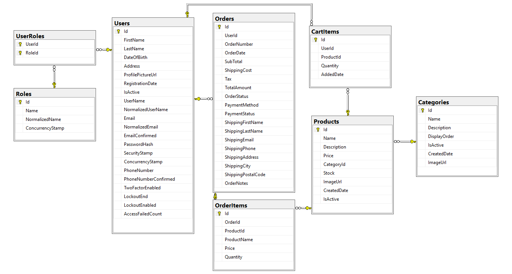

# Bazzar BD ecommerce platform - ASP.NET Core MVC

A complete e-commerce product management system built with ASP.NET Core MVC (.NET 9), Entity Framework Core, and Bootstrap 5. This project is designed for educational purposes as part of "The Ultimate Real World C# ASP.NET Core MVC Project Tutorial For Beginners Bangla" tutorial series.


## 📋 Table of Contents

- [Features](#-features)
- [Technologies Used](#-technologies-used)
- [System Requirements](#-system-requirements)
- [Getting Started](#-getting-started)
- [Project Structure](#-project-structure)
- [Database Schema](#-database-schema)
- [User Roles](#-user-roles)
- [Screenshots](#-screenshots)
- [API Endpoints](#-api-endpoints)
- [Contributing](#-contributing)
- [License](#-license)

## ✨ Features

### User Management

- **User Registration & Login** - Complete authentication system with ASP.NET Core Identity
- **Role-Based Access Control** - Three roles: Admin, Manager, and Customer
- **User Profile Management** - Update profile information, change password
- **Profile Picture Upload** - Support for user profile images

### Product Management

- **CRUD Operations** - Create, Read, Update, Delete products
- **Product Categories** - Organize products into categories
- **Image Upload** - Support for product and category images
- **Stock Management** - Track inventory levels with low stock alerts
- **Product Search & Filtering** - Advanced search and filter options
- **Product Sorting** - Sort by name, price, date, stock level

### Category Management

- **Category CRUD** - Complete category management
- **Category Images** - Visual representation for categories
- **Display Order** - Control category display sequence
- **Product Count** - Track number of products per category

### Shopping Cart

- **Add to Cart** - Add products with quantity selection
- **Cart Management** - Update quantities, remove items, clear cart
- **Cart Persistence** - Cart saved per user in database
- **Stock Validation** - Prevent over-ordering
- **Price Calculation** - Automatic subtotal, tax, and shipping calculation

### Order Management

- **Checkout Process** - Complete order placement workflow
- **Order History** - Customers can view their past orders
- **Order Tracking** - Track order status (Pending, Processing, Shipped, Delivered)
- **Order Cancellation** - Cancel pending orders with stock restoration
- **Invoice Generation** - Print-friendly invoice pages
- **Payment Methods** - Support for Cash on Delivery, Card (Pending), Mobile Banking (Pending)

### Admin Dashboard

- **User Management** - View, edit, activate/deactivate users
- **Product Management** - Comprehensive product administration
- **Category Management** - Full category control
- **Order Management** - Process and track all orders
- **Statistics Dashboard** - Overview of key metrics
- **Role Assignment** - Assign and remove user roles

### Additional Features

- **Responsive Design** - Mobile-friendly interface with Bootstrap 5
- **Search Functionality** - Global search across products
- **Pagination** - Efficient handling of large datasets
- **Image Upload System** - Organized file storage
- **Seed Data** - Pre-populated demo data for testing
- **Access Control** - Route protection based on roles
- **Beautiful UI** - Modern, professional design

## 🛠 Technologies Used

### Backend

- **ASP.NET Core MVC 9.0** - Web application framework
- **Entity Framework Core 9.0** - ORM for database operations
- **ASP.NET Core Identity** - Authentication and authorization
- **SQL Server** - Database management system
- **LINQ** - Data querying

### Frontend

- **Bootstrap 5.3** - Responsive CSS framework
- **Bootstrap Icons** - Icon library
- **JavaScript (ES6+)** - Client-side interactivity
- **jQuery** - DOM manipulation
- **HTML5 & CSS3** - Markup and styling

### Development Tools

- **Visual Studio 2022** - IDE
- **SQL Server Management Studio** - Database management
- **Git** - Version control

## 💻 System Requirements

- **.NET 9.0 SDK** or later
- **SQL Server 2019** or later (Developer Edition is sufficient)
- **Visual Studio 2022** (Community Edition or higher)
- **4GB RAM** minimum (8GB recommended)
- **Windows 10/11** or **macOS** or **Linux**

## 🚀 Getting Started

### 1. Clone the Repository

```
git clone https://github.com/codinganatomy/bazar-bd.git
cd BazzarBD
```

### 2. Configure Database Connection

Open `appsettings.json` and update the connection string:

```
{
  "ConnectionStrings": {
    "DefaultConnection": "Server=(localdb)\mssqllocaldb;Database=BazarDB;Trusted_Connection=True;MultipleActiveResultSets=true"
  }
}
```

### 3. Apply Database Migrations

Open Package Manager Console in Visual Studio

```
Add-Migration InitialCreate
Update-Database
```

### 4. Run the Application

Using Visual Studio: `Press F5` or `Ctrl+F5`
Using CLI: `dotnet run`

### 5. Default Login Credentials

**Admin Account:**

- Email: `admin@bazarbd.com`
- Password: `Admin@123`

**Customer Account:**

- Email: `john@example.com`
- Password: `John@123`

**Manager Account:**

- Email: `manager@productmanagement.com`
- Password: `Manager@123`

## 📁 Project Structure

```bash
BazzarBD/
├── Controllers/ # MVC Controllers
│ ├── AccountController.cs
│ ├── AdminController.cs
│ ├── CartController.cs
│ ├── CategoryController.cs
│ ├── HomeController.cs
│ ├── OrderController.cs
│ └── ProductController.cs
├── Data/ # Database Context
│ ├── ApplicationDbContext.cs
│ └── DbInitializer.cs
├── Models/ # Entity Models
│ ├── ApplicationUser.cs
│ ├── CartItem.cs
│ ├── Category.cs
│ ├── Order.cs
│ ├── OrderItem.cs
│ └── Product.cs
├── ViewModels/ # View Models
│ ├── CartViewModel.cs
│ ├── CategoryManagementViewModel.cs
│ ├── ChangePasswordViewModel.cs
│ ├── CheckoutViewModel.cs
│ ├── LoginViewModel.cs
│ ├── OrderManagementViewModel.cs
│ ├── ProductManagementViewModel.cs
│ ├── RegisterViewModel.cs
│ ├── UserDetailsViewModel.cs
│ ├── UserManagementViewModel.cs
│ └── UserManagementViewModel.cs
├── Views/ # Razor Views
│ ├── Account/
│ ├── Admin/
│ ├── Cart/
│ ├── Category/
│ ├── Home/
│ ├── Order/
│ ├── Product/
│ └── Shared/
├── wwwroot/ # Static Files
│ ├── css/
│ ├── images/
│ │ ├── categories/
│ ├── features/
│ │ ├── products/
│ │ └── profiles/
│ ├── js/
│ └── lib/
├── Migrations/ # EF Core Migrations
├── appsettings.json # Configuration
└── Program.cs # Application Entry Point
```

## 🗄 Database Schema

### Core Tables



## 👥 User Roles

### Admin

- Full system access
- User management (create, edit, delete, assign roles)
- Product management (CRUD operations)
- Category management (CRUD operations)
- Order management (view, update status, delete)
- Access to all statistics and reports

### Manager

- Product management (CRUD operations)
- Category management (CRUD operations)
- Order management (view, update status)
- Limited user access
- Cannot delete orders or manage users

### Customer

- Browse products and categories
- Add items to cart
- Place orders
- View order history
- Manage own profile
- Cancel pending orders

## 📸 Demo


## 🔌 API Endpoints

### Public Routes

- `GET /` - Home page
- `GET /Product` - Product listing
- `GET /Product/Details/{id}` - Product details
- `GET /Category` - Category listing

### Authentication Required

- `GET /Cart` - View cart
- `POST /Cart/AddToCart` - Add item to cart
- `GET /Cart/Checkout` - Checkout page
- `POST /Cart/PlaceOrder` - Submit order
- `GET /Order/MyOrders` - Order history

### Admin/Manager Only

- `GET /Admin/Users` - User management
- `GET /Admin/Products` - Product management
- `GET /Admin/Categories` - Category management
- `GET /Admin/Orders` - Order management

## 🤝 Contributing

Contributions are welcome! Please follow these steps:

1. Fork the repository
2. Create a feature branch (`git checkout -b feature/AmazingFeature`)
3. Commit your changes (`git commit -m 'Add some AmazingFeature'`)
4. Push to the branch (`git push origin feature/AmazingFeature`)
5. Open a Pull Request

## 📝 Development Notes

### Adding New Products

Products can be added through:

1. Admin/Manager interface at `/Admin/Products`
2. Direct creation at `/Product/Create`
3. Seed data in `ApplicationDbContext.cs`

### Image Upload

Images are stored in:

- Products: `wwwroot/images/products/`
- Categories: `wwwroot/images/categories/`
- Users: `wwwroot/images/profiles/`

### Database Seeding

The application includes seed data for:

- 3 Roles (Admin, Manager, Customer)
- 4 Users (1 Admin, 1 Manager, 2 Customers)
- 5 Categories
- 42 Sample Products

## 🐛 Known Issues

- Email confirmation is currently disabled (development only)
- Payment gateway integration is placeholder only
- Invoice printing works best in Chrome/Edge

## 🔮 Future Enhancements

- [ ] Payment gateway integration (Stripe/PayPal)
- [ ] Email notifications for orders
- [ ] Product reviews and ratings
- [ ] Wishlist functionality
- [ ] Advanced analytics dashboard
- [ ] Product variants (size, color)
- [ ] Coupon/discount system
- [ ] Multi-language support
- [ ] Export orders to Excel/PDF

## 📄 License

This project is licensed under the MIT License - see the [LICENSE](LICENSE) file for details.

## 👨‍💻 Author

### Your Name

- YouTube: [Your Channel](https://youtube.com/yourchannel)
- GitHub: [@yourusername](https://github.com/yourusername)
- Email: <your.email@example.com>

## 🙏 Acknowledgments

- ASP.NET Core Documentation
- Bootstrap Team
- Entity Framework Core Team
- Stack Overflow Community
- Tutorial Series Participants

## 📞 Support

For questions or issues:

- Open an issue on GitHub
- Email: <codinganatomy@gmail.com>
- Join our Discord: [Discord Invite Link]

---

**⭐ If you find this project helpful, please give it a star!**

Made with ❤️ for the ASP.NET Core community
